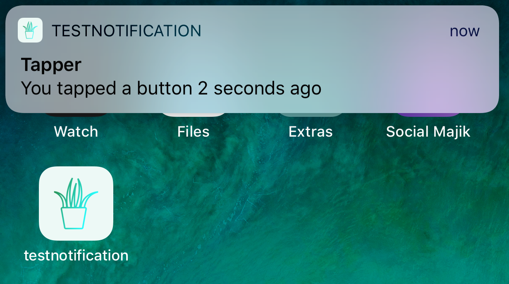

# Test Notification

## What It Does
App shows a notification to the user 2 seconds after user clicks a button

This is an arbitrary application that simply shows the minimum necessary to create LOCAL NOTIFICATIONS

## To Use
clone and run in xcode

Because it is a badge and not handled WITHIN the app, you will not see the notification unless you press the home button after pressing "tap me"

## Credits
The beautiful testnotification app icon is from Launchaco
